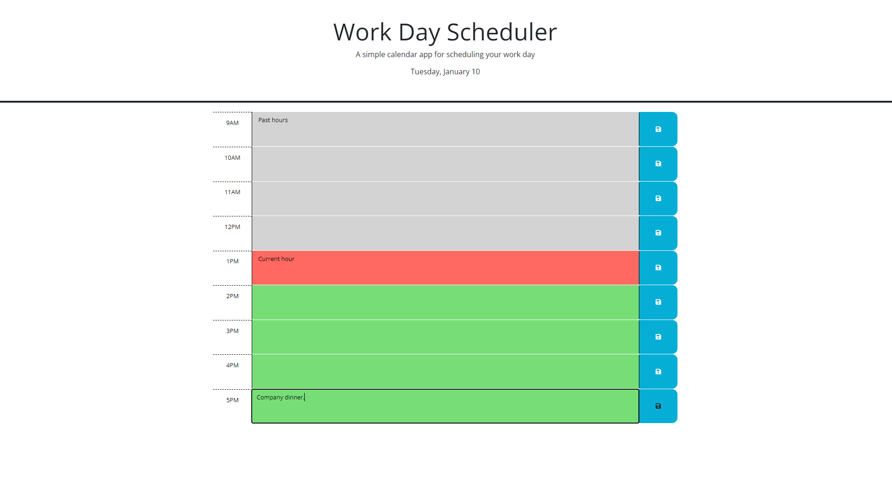
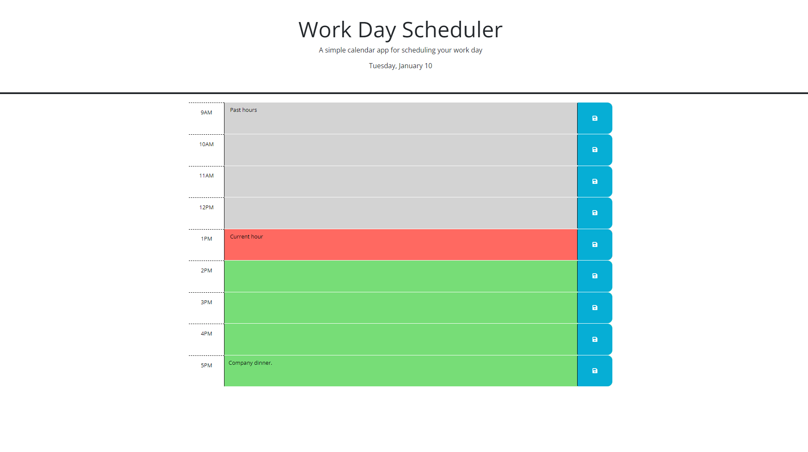

# Work-Day-Scheduler

Visit the deployed application [Here.](https://re-gi.github.io/Work-Day-Scheduler/)

## Description
This is a simple work-day scheduling application that allows the user to input events for each working hour from 9am to 5pm and save the events to their device.

In the application header, the date is displayed with Day.js and refreshed every second to stay current.

Each time-block is color-coded in accordance with the current hour of the day, obtained from Day.js. Past hours are color-coded gray, the present hour red, and future hours green. These colored areas are the text-boxes into which users can type their events.

The blue save icons on the right of each time-block will save any current text-input to the user's local storage, so that following page loads will display the saved text in the same time-block it was entered into.

## Installation
N/A

## Usage
To use the scheduler, the user should first choose the hour they would like to enter their event into, then click on the colored text-box of that hour to type in their event.

Once the event is typed, the user should click on the blue save icon to the right of their input to save the new event to that time-block.

## Credits

## Liscense
Refer to liscensing in the project repository.